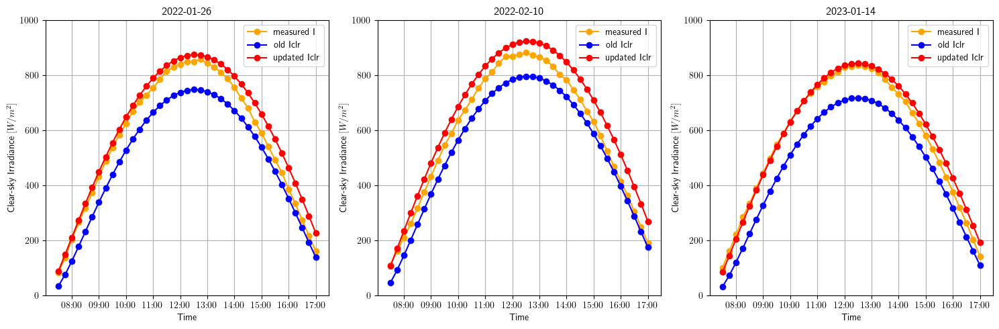

# Thailand Clear-sky Model (based on Ineichen and Perez 2002)


**Clear-sky model** is a model provide irradiance under cloud-free conditions, representing the solar irradiance at a specific location. These models utilize various input variables, including ozone, humidity, and solar zenith angle ($\theta(t)$). Numerous models have been proposed, each employing different sets of input variables. One widely used model, known for its simplicity due to its few parameters, is the *Ineichen model*, which defines clear-sky irradiance as

$$ 
I_{\mathrm{clr}} = a_{1}I_{0} \cos(\theta(t))e^{-a_{2}(f_{h_1}+f_{h_2}(T_{L}-1))AM(t)}
$$

The Linke turbidity coefficient $T_L$ in the model values vary depending on the location. Therefore, this repository introduce [experiment](./adjusted_TL_experiment.ipynb) to adjust the $T_L$ to be suitable for each specific location.


## How to use ClearskyCalculator class

``` python
import pandas as pd
import numpy as np
from solar_utils.clear_sky_calculator import ClearskyCalculator

# Initialize the instance by defining latitude and longitude to retrieve relevant parameters

lat = 9.302
long = 110.833
site_obj = ClearskyCalculator(lat, long)

# Define the data range to calculate clear-sky information

start_date = '2023-01-01'
end_date = '2023-01-02'
freq = '15min'
choice = 'estimate'
solar_info_df = site_obj.get_solar_info(start_date=start_date, end_date=end_date, freq=freq, choice=choice)
```

## Adjusting $T_L$ experiment

We have filtered clear-sky days based on the rate of change (ROC), where the concept involves clear-sky day data increasing until midday and then decreasing until the end of the day, ensuring that each day has exactly one concave point. Moreover, a critical criterion for meeting the filtering criteria has been that all clear-sky indices from all data points must have surpassed a specific value (now set at threshold_k=0.7). Following this filtering process, TL has been updated using linear and Huber regression with an iterative method until convergence is achieved.

*Example results*

## References

The development of this repository is based on the research described in the following papers : 

[Ineichen, P., & Perez, R. (2002). A new airmass independent formulation for the Linke turbidity coefficient. Solar Energy, 73(3), 151-157.](https://www.sciencedirect.com/science/article/abs/pii/S0038092X02000452) 


[Janjai, S., Kumharn, W., & Laksanaboonsong, J. (2003). Determination of Angstrom's turbidity coefficient over Thailand. Renewable Energy, 28(11), 1685-1700.](https://www.sciencedirect.com/science/article/abs/pii/S0960148103000107?via%3Dihub)