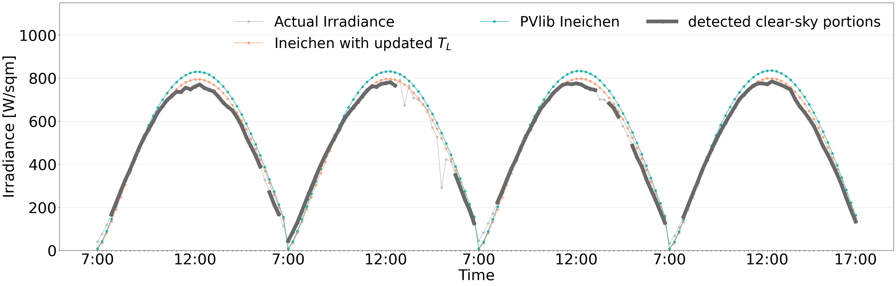

# Thailand Clear-sky Model (based on Ineichen and Perez 2002)


**Clear-sky model** is a model provide irradiance under cloud-free conditions, representing the solar irradiance at a specific location. These models utilize various input variables, including ozone, humidity, and solar zenith angle ($\theta$(t)). Numerous models have been proposed, each employing different sets of input variables. One widely used model, known for its simplicity due to its few parameters, is the *Ineichen model*, which defines clear-sky irradiance as

$$ 
I_{\mathrm{clr}}(t) = a_{1}I_{0} \cos(\theta(t))e^{-a_{2}(f_{h_1}+f_{h_2}(T_{L}-1))AM(t)}
$$

The Linke turbidity coefficient $T_L$ in the model values vary depending on the location. Therefore, this repository introduce [experiment](./evaluate_monthly_TL.ipynb) to adjust the $T_L$ to be suitable for each specific location.


## How to use ClearskyCalculator class

The ClearskyCalculator class requires the latitude and longitude of a specific location, the defined altitude (alt), and the monthly $T_L$ values. Below is an example of how to use the class:
``` python
import pandas as pd
import numpy as np
from solar_utils.clearsky_calculator import ClearskyCalculator

# Initialize the instance by defining latitude and longitude to retrieve relevant parameters
lat = 13.7563  # Latitude for Bangkok, Thailand
long = 100.5018  # Longitude for Bangkok, Thailand
defined_alt = 8 # Can get from any APIs.


# Provided monthly TL values
monthly_TL = np.array([2.900, 3.414, 4.005, 4.271, 
                       4.245, 3.814, 3.704, 3.440, 
                       3.156, 3.223, 2.730, 2.835])

# Initialize the ClearskyCalculator with provided monthly TL values
site_obj = ClearskyCalculator(lat=lat, long=long, defined_alt=defined_alt, monthly_TL=monthly_TL)

# Define the date range to calculate clear-sky information
start_date = '2024-01-01'
end_date = '2024-01-02'
freq = '15min'
choice = 'monthly_estimate'

# Retrieve the solar information
solar_info_df = site_obj.get_solar_info(start_date=start_date, end_date=end_date, freq=freq, choice=choice)

# Print the head of the resulting DataFrame
print(solar_info_df.head())

```
For users who need to work with other sites where the configuration file does not include altitude and monthly Link Turbidity, you can obtain these values using the following approach: for altitude, you can use [OpenTopography](https://www.opentopodata.org/), and for monthly Link Turbidity, you can use relevant data sources like the pvlib library.

```python
import requests
import pandas as pd
import pvlib

# Given coordinates
lat = 13.73677405
long = 100.5321224

# Function to get elevation
def get_elevation(lat, long):
    url = f'https://api.opentopodata.org/v1/srtm30m?locations={lat},{long}'
    response = requests.get(url)
    if response.status_code == 200:
        elevation = response.json()['results'][0]['elevation']
        return elevation
    else:
        return None

# Function to obtain monthly Linke turbidity
def obtain_tl_months(lat, long):
    times = pd.date_range(start='2020-01-01', end='2020-12-31', freq='MS')
    linke_turbidity = pvlib.clearsky.lookup_linke_turbidity(times, lat, long)
    return linke_turbidity.values

# Get elevation
defined_alt = get_elevation(lat, long)

# Obtain monthly Linke turbidity
monthly_TL = obtain_tl_months(lat, long)

```

## Adjusting $T_L$ experiment

We used the [PVlib clear-sky detection algorithm](https://pvlib-python.readthedocs.io/en/stable/reference/generated/pvlib.clearsky.detect_clearsky.html#pvlib.clearsky.detect_clearsky) to identify data for adjusting $T_L$ using a non-linear regression method. The figure below shows the results of the calculated clear-sky irradiance based on the updated $T_L$ values and embedded in PVlib.



*Example results*


## References


The development of this repository is based on the research described in the following papers : 

[Ineichen, P., & Perez, R. (2002). A new airmass independent formulation for the Linke turbidity coefficient. Solar Energy, 73(3), 151-157.](https://www.sciencedirect.com/science/article/abs/pii/S0038092X02000452) 

[Reno, M. J., & Hansen, C. W. (2016). Identification of periods of clear sky irradiance in time series of GHI measurements. Renewable Energy, 90, 520-531.](https://www.sciencedirect.com/science/article/abs/pii/S0960148115305358)

[Janjai, S., Kumharn, W., & Laksanaboonsong, J. (2003). Determination of Angstrom's turbidity coefficient over Thailand. Renewable Energy, 28(11), 1685-1700.](https://www.sciencedirect.com/science/article/abs/pii/S0960148103000107?via%3Dihub)

